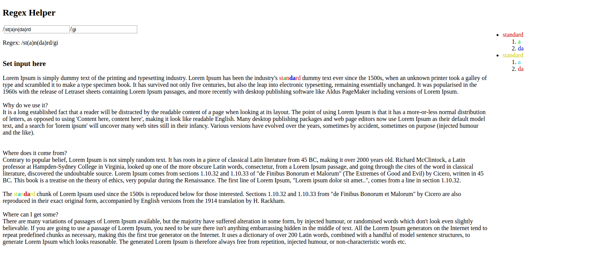

# Regex Helper

## What is this

This is a simple regex parser that colorizes javascript regex matches. I find it useful when generating and testing regexes.

## How to install

[Install yarn](https://yarnpkg.com/lang/en/docs/install/#windows-stable)

Clone this repo, or download it


Run Yarn install on the repo

```
yarn install
```

Run the dev server

```
yarn dev
```


